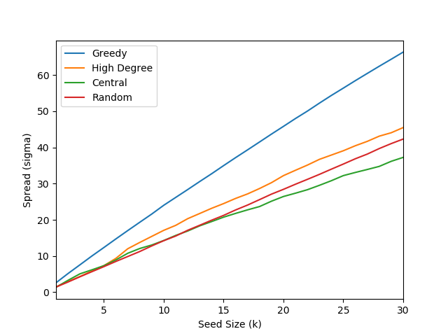

\newcommand{\inputtable}[1]{\input{#1}}

# Introduction
An enormous volume of literature has provided evidence of rising traffic congestion and its costs: for example, @cookson_inrix_2018 finds that in 2018 Americans spent extra 97 hours on the streets due to congestion, and the costs amount to $87 billion. Different policies have been suggested to cope with the challenge, but many of them, regarding road capacity in particular, are financially implausible (improving road networks or public transportation system), or politically implausible (vehicle quota or rush-hour tolls). 

A more realistic approach to the problem is to focus on more preventable causes of congestion. In contrast to causes such as overcrowding or human error accidents, work zones and weather (contributing to 10% and 25% of congestion, respectively, according to the United States Department of Transportation[^usdot]), have large room for improvement through policy interventions. More specifically, under limited budget and resources, a smart prioritization policy by local governments can be effective in reducing congestion. In case of heavy snow, which street should local governments prioritize with snow removal? Can local governments reduce congestion with better construction planning?

[^usdot]: https://ops.fhwa.dot.gov/aboutus/opstory.htm

Previous traffic literature has mostly focused on the structural aspects of road networks. For example, @holme_congestion_2003 looks into the relationship between centrality measures and traffic density. @agryzkov_algorithm_2012 uses the PageRank model to rank streets in an urban road network. While such measures provide intuitive insights on road networks, they are short of capturing the traffic flow dynamics.

This paper takes an influence maximization approach to the problem, which considers not only structural properties of networks, but also their propagation dynamics. The approach has been popular for analyzing the spread of information or the contagion of epidemic disease in a social network. Solving the influence maximization problem in the setting of road networks would identify the most "influential", or disruptive, road segments. Using a minimal Independent Cascade (IC) model, I present a simple yet effective approach to compute the relative importance of road segments. As a case study, the analysis is applied to a real world road network in Manhattan, New York City. Solving the maximization problem with the greedy algorithm outperforms other heuristic-based methods by 45.8%. For policymakers, better understanding of traffic networks will help with prioritizing and allocating resources, contributing to reducing traffic congestion in large cities.[^github]

[^github]: All data and codes are available at https://github.com/muyangshin/AM221-final-project

# Modeling Traffic Congestion
## Propagation of Traffic Congestion as the Problem of Influence Maximization
In this paper, I define a road network $G' = (V, E')$ as a directed graph where $V$ is a set of one-way road segments and $E$ is a set of junctions $e'_{ij}$ between a road segment $v_i$ and its destination $v_j$. 

Traffic congestion is defined as a binary state: congested and uncongested. Traffic congestion in a road segment $v_j$ is caused by one of its next road segments, $v_i$. Intuitively, congestion arises when a vehicle in $v_j$ cannot advance fast enough to a next road segment $v_i$. Therefore, the congestion network corresponding to $G'$ is its reverse, $G = (V, E)$, where $e_{ij} \in E$ for all $e_{ji} \in E'$. To avoid confusion, all discussions below are based on the congestion network $G$, not the road network $G'$. Figure 1 shows an example of converting real world roads into a road network (blue) and a congestion network (orange).

For further simplification, I make a couple of assumptions on the congestion network. First, traffic congestion in a road segment is caused only by existing congestion. In other words, a road network is assumed to have been efficiently designed so that congestion does not naturally arise. Congestion in the initial set is then caused exogenously by, for example, heavy snow or construction work. Second, traffic flow from a node $v_j$ to $v_i$ follows a multinomial distribution whose probability is proportional to $v_i$'s street width. Under this assumption, $w_i / \sum_{k: e_{kj} \in E} w_k$ represents the relative importance of a source node $v_i$ to a destination node $v_j$. 

In this setting, I model the propagation of traffic congestion using a simple IC model. With an initial seed set $S$, the cascade process proceeds in discrete steps: each congested node $v_i$ is given a single chance to activate each of its destination node $v_j$ with a probability $p_{ij}$ independently of the process so far. The process runs until no more activations are made, and the influence spread $\sigma(S)$ is defined to be the number of congested nodes at the end of the process.

In particular, the activation probability $p_{ij}$ from $v_i$ to $v_j$ is modeled as follows:
$$p_{ij} = c \cdot \frac{w_i}{\sum_{k: e_{kj} \in E} w_k}$$
where $c$ denotes the baseline likelihood of propagation. Since $\sum_{i: e_{ij} \in E} p_{ij} = c$, and $1 - \Pi_{i: e_{ij} \in E} (1 - p_{ij}) \approx 1 - (1 - \sum_{i: e_{ij} \in E} p_{ij}) = c$, the baseline likelihood $c$ can be interpreted as the likelihood of a road segment becoming congested when all of its source nodes are congested.

The goal of the problem is then to find a seed set $S^*$ of cardinality $k$ to maximize its influence spread $\sigma(S^*)$. In the setting of congestion networks, $S^*$ can be interpreted as the most "influential", or disruptive, road segments.

Obviously, this simplification does not necessarily convey an accurate picture of congestion propagation in the real world. One of the biggest issues is the assumption of independence: a real world driver would be likely to make a detour in case of a congested road. Therefore, the likelihood of propagation to a node $v_j$ is not independent of other source nodes of $v_j$. However, I expect that a such simple model can still provide useful approximation of the real world congestion propagation. 

Another concern is the choice of $c$. While it is possible to fit real world traffic data into the assumed functional form of $p_{ij}$ to empirically estimate the value of $c$, due to limited data availability[^traffic-speed], this paper uses 0.3 as a baseline value. Different values of $c$ only scale up or down probabilities; since the purpose of this paper is to identify the relative importance of road segments, I expect some level of robustness to the choice of $c$. In the experiment section, the baseline results are compared to those with $c = 0.1$ and $0.5$.

[^traffic-speed]: For example, NYC provides data on real time traffic speed at a five-minute interval (http://data.beta.nyc/dataset/nyc-real-time-traffic-speed-data-feed-archived). However, the number of Manhattan road segments available in the latest dataset is fewer than 50.

## Solving the Problem
The influence function $\sigma(\cdot)$ in the IC model is known to be submodular and monotone. A function $f$ is *submodular* if $f(S \cup \{v\}) - f(S) \geq f(T \cup \{v\}) - f(T)$ for all $v \in V$ and $S \subseteq T$. A function $f$ is *monotone* if $f(S) \leq f(T)$ for all $S \subseteq T$. 

@kempe_maximizing_2003 shows that the problem of influence maximization is NP-hard for the IC model. The authors (KKT) then exploit the submodularity and monotonicity of $\sigma(\cdot)$ in the IC model to prove that a greedy algorithm, choosing a node with the maximum marginal influence spread at each round, provides a $(1 - 1/e)$-approximation to the optimal solution.

Following the results by @kempe_maximizing_2003, this paper approximates the optimum by using a simple greedy algorithm. 

# Experiment
## Data
This paper analyzes the intracity road network in Manhattan, New York City. New York City is known to be one of the most congested cities in the United States[^Inrix-NYC]. NYC Street Centerline[^centerline] provides road segment-level data on latitude and longitude coordinates, direction of traffic, and street width. Since Manhattan is an island connected to other areas only by bridges and tunnels, it is possible to isolate intracity traffic from intercity traffic. 

[^Inrix-NYC]: According to the 2018 Global Traffic Scorecard by INRIX, Inc., New York City is the fourth most congested city in the United States, inflicting a cost of $1,859 per driver annually.
[^centerline]: https://data.cityofnewyork.us/City-Government/NYC-Street-Centerline-CSCL-/exjm-f27b

Two road segments are defined to be connected if they share the same latitude and longitude coordinates as one of their endpoints. To simplify the network, I collapsed two connected nodes into one, when their only outgoing and incoming edge, respectively, is each other. I also assume that U-turn is not allowed in all streets; otherwise, an one-way road segment in a two-way road segment should be connected to its sister one-way road segment. 

Filtering for vehicular streets in Manhattan, I constructed a congestion network with 12,028 nodes and 23,718 edges. The mean street width is 30.70 feet. One notable characteristic of the dataset is that a node's degree is clearly bounded: degrees range from 1 to 5. Compared to other influence maximization settings such as social networks, the magnitude of submodularity of the spread function is expected to be smaller in this dataset, and it is unlikely to have a few nodes with very high influence.

## Implementation of the Greedy Algorithm
As discussed above, the greedy algorithm guarantees $(1 - 1/e)$-approximation to the optimal solution. However, given a seed set $S$, it is not straightforward to compute the influence function $\sigma(S)$. @kempe_maximizing_2003 shows that using Monte Carlo simulations to estimate $\sigma(S)$ guarantees a $(1 - 1/e - \epsilon)$-approximation. 

Another problem with the simple greedy algorithm is its complexity. The algorithm is expected to be slow because the influence maximization problem is NP-hard, and Monte Carlo simulations need to be run for every node. Different improvements based on heuristics have been proposed. In particular, @leskovec_cost-effective_2007 presents the Cost-Effective Lazy Forward (CELF) algorithm to speed up the process; an initial round is as slow as the KKT greedy algorithm, but subsequent rounds require much fewer node lookups by storing and reusing marginal gains in the previous round. CELF++ by @goyal_celf_2011 attempts to further improve the speed, but unlike their findings that it is 35-55% faster than CELF, @lv_improved_2014 shows that CELF usually outperforms CELF++, in particular for a smaller seed size. 

In this paper, I use CELF with 10,000 Monte Carlo simulations to approximate the optimal solution. @kempe_maximizing_2003 finds that Monte Carlo simulations with 10,000 iterations provide approximation of a similar quality to that with 300,000 or more iterations. 

To measure the performance of the greedy algorithm, the results are compared to those obtained by heuristics based on the network structure, similar to those used in @kempe_maximizing_2003. First, the high-degree heuristic chooses nodes with the highest degree. Second, the central heuristic chooses nodes in the order of closeness centrality. Last, the random heuristic choses nodes uniformly at random. 

## Results
Figure 2 shows the geographic visualization of the nodes selected by the algorithm for $k = 100$, which is about 1% of the nodes. Darker parts represent nodes that were selected in earlier rounds. At $k = 100$, the baseline model with $c = 0.3$ estimates the spread of 198.28, while models with $c = 0.1$ and $0.5$ estimate 123.13 and 311.48, respectively. One noticable difference from @kempe_maximizing_2003 is that the first few nodes selected by the greedy algorithm are not as influential as in their dataset. The difference is likely due to the low variability of degrees in road networks.

#### Comparisons with Heuristics
Figure 3 shows the performance of the greedy algorithm compared to that of other methods. At $k = 30$, it outperforms the high-degree heuristic by 45.8%, the random heuristic by 56.8%, and the closeness centrality heuristic by 78.1%. The greedy algorithm is significantly better at identifying disruptive road segments.

There are two notable differences from @kempe_maximizing_2003: first, the performance improvement is much larger (they find 18%); second, the random method performs far better. These differences are again likely due to the low variability of degrees in road networks. Since the highest degree is 5, having a high degree is not as a useful indicator as in the co-authorship network. At the same time, choosing nodes at random is less likely to lead to a huge loss in the spread. 

#### Choice of $c$
Table \ref{tab:tab_top_20_nodes_different_c} shows the first 20 nodes returned by the greedy algorithm for the baseline model with $c = 0.3$, compared to the models with $c = 0.1$ and $0.5$. The results are consistent with the expectations made earlier; most of the nodes are also chosen by the models with different values of $c$. 

Interestingly, Node 2086, which corresponds to Grove St between West 4th St and 7th Ave S, was chosen in the first round for both $c = 0.3$ and $0.1$, but not returned at all in the first 100 rounds for $c = 0.5$. Instead, its neighbor and only source node, 7th Ave S between Grove St and Barrow St, was chosen in the first round for $c = 0.5$. This suggests that a larger unit of analysis than a road segment, such as a neighborhood consisting of a few road segments, might also provide useful insights on identifying most disruptive parts of road networks.

\inputtable{tex/top_20_nodes_with_different_c.tex}

# Conclusion
This paper takes a new approach to the identification of most disruptive road segments in traffic networks. Analyzing the propagation of traffic congestion using a simple Independent Cascade model, I use the results from @kempe_maximizing_2003 to solve the resulting influence maximization problem. When applied to the real world traffic network in Manhattan, New York City, the greedy algorithm significantly outperforms other heuristics. The resulting seed sets are mostly robust to different choices of baseline likelihood of propagation. The results suggest that the IC model can provide useful insights to policymakers on prioritizing road segments and allocating resources to reduce urban traffic congestion.

This paper raises a number of issues for future research. Although the analysis demonstrates that the results are robust to the choice of $c$, the paper makes a few simplification assumptions on traffic flow and propagation process. Further analysis of traffic propagation using different models such as linear threshold, coupled with the analysis of real world traffic flow data, would provide a more accurate picture of traffic congestion propagation.

# References

